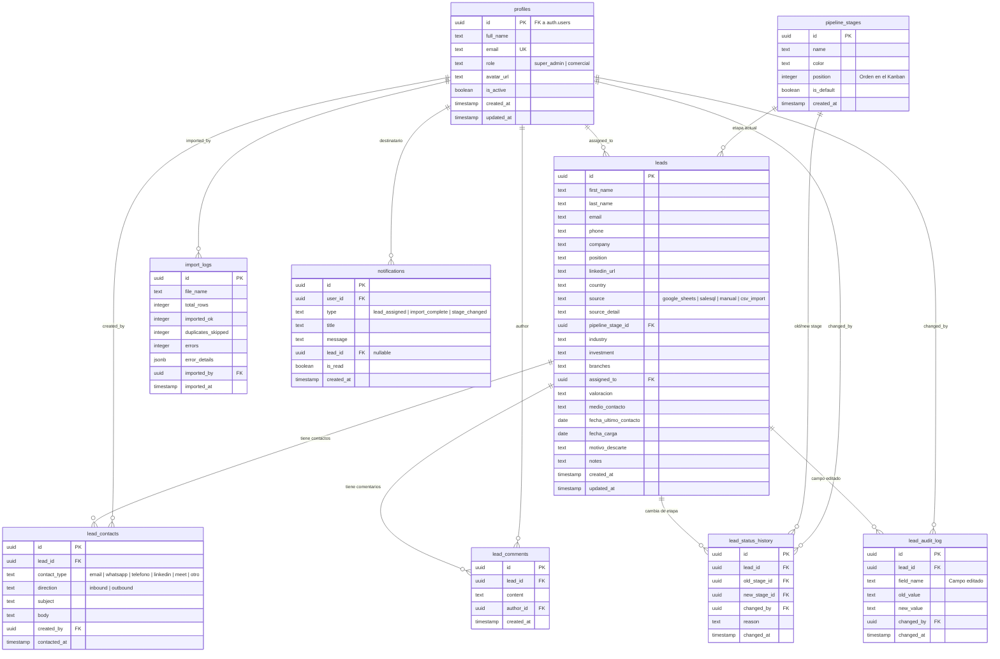
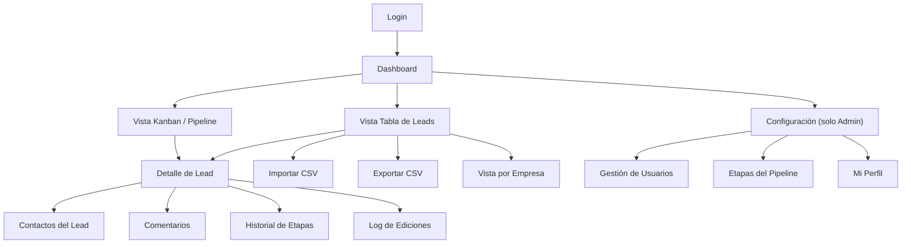

# 🏗️ CRM Expansión Franquicias — Negozona

**empresa_id:** `negozona`  
**Fecha:** 2026-07-09  
**Versión:** Final (todas las preguntas resueltas)  
**Tipo:** Plan de Implementación Técnico — CRM Web App  

---

## 📋 Resumen

Aplicación web tipo CRM para gestionar leads de franquicias. Los comerciales de Negozona podrán visualizar, gestionar y dar seguimiento a leads desde un dashboard centralizado con vistas de tabla y Kanban, importar/exportar datos vía CSV, y registrar interacciones por lead.

**Cada lead = una persona.** La empresa (`company`) es un atributo del lead, no una entidad separada. Múltiples leads pueden pertenecer a la misma empresa.

---

## 🧱 Stack Tecnológico Definitivo

| Capa | Tecnología | Justificación |
|------|-----------|---------------|
| **Build tool** | Vite | Bundler rápido, HMR instantáneo, zero-config para JS vanilla |
| **Lenguaje** | JavaScript (ES Modules) | Sin framework pesado, vanilla JS con módulos |
| **Estilos** | Tailwind CSS | Utility-first, rápido de iterar, consistente |
| **Base de datos + Auth + API** | Supabase | PostgreSQL + Auth + RLS + API REST automática + Realtime |
| **Gráficos** | Chart.js | Ligera (~60kb gzipped), flexible, buena estética por defecto |
| **Drag & Drop (Kanban)** | SortableJS | Librería ligera (~8kb), sin dependencias |
| **Hosting** | Cloudflare Pages | Deploy automático desde GitHub, tier gratuito generoso |
| **Repositorio** | GitHub | Monorepo — cada push a `main` deploya automáticamente |

---

## 🌐 Infraestructura

| Servicio | Detalle |
|----------|---------|
| **Supabase** | Proyecto creado manualmente por el cliente desde la web de Supabase. Región recomendada: South America (São Paulo) |
| **Cloudflare Pages** | Dominio inicial: el subdominio gratuito que asigne Cloudflare al desplegar (ej: `negozona-crm.pages.dev`). En el futuro se puede apuntar un dominio propio |
| **GitHub** | Repositorio `negozona-crm`. Cloudflare Pages conectado para deploy automático en cada push a `main` |

---

## 👥 Usuarios Iniciales

| Nombre | Email | Rol |
|--------|-------|-----|
| Martín | martin@negozona.com | Super Admin (Administrador del sistema) |
| Francisco Bastard | fbastard@negozona.com | Super Admin |
| Camila Bastard | camila@negozona.com | Comercial |
| Ariana Spenza | ariana@negozona.com | Comercial |

**Flujo de alta de usuarios:**
- El Super Admin invita nuevos usuarios enviando un **magic link por email** (Supabase Auth `inviteUserByEmail`)
- El usuario recibe el link, crea su contraseña, y queda activo con el rol pre-asignado
- No existe registro público — solo por invitación

---

## 📦 Modelo de Datos (Supabase / PostgreSQL)

### Diagrama Entidad-Relación



---

### Detalle de Tablas

#### 1. `profiles` — Usuarios del sistema
Extiende `auth.users` de Supabase con datos de perfil y rol.

| Campo | Tipo | Descripción |
|-------|------|-------------|
| `id` | uuid PK | Mismo ID que `auth.users.id` |
| `full_name` | text | Nombre completo |
| `email` | text (UK) | Email de login |
| `role` | text | `super_admin` o `comercial` |
| `avatar_url` | text | URL de avatar (opcional) |
| `is_active` | boolean | Para desactivar sin borrar |
| `created_at` | timestamp | Fecha de creación |
| `updated_at` | timestamp | Última actualización |

**RLS:**
- Super Admin: ve y edita todos los perfiles
- Comercial: ve solo su propio perfil, no accede a gestión de usuarios

---

#### 2. `leads` — Tabla central de contactos/leads
Almacena cada lead con todos sus datos. **La empresa (`company`) puede repetirse** en múltiples leads.

| Campo | Tipo | Origen CSV | Descripción |
|-------|------|-----------|-------------|
| `id` | uuid PK | — | Generado automáticamente |
| `first_name` | text | `first_name` | Nombre |
| `last_name` | text | `last_name` | Apellido |
| `email` | text | `email` | Email principal |
| `phone` | text | `phone` | Teléfono |
| `company` | text | `company` | Empresa/Marca |
| `position` | text | `position` | Cargo |
| `linkedin_url` | text | `linkedin_url` | URL de LinkedIn |
| `country` | text | `country` | País |
| `source` | text | `source` | Origen del dato |
| `source_detail` | text | `source_detail` | Detalle del origen |
| `pipeline_stage_id` | uuid FK | Mapeado desde `status` | Etapa en el pipeline |
| `industry` | text | `industry` | Rubro/Industria |
| `investment` | text | `investment` | Inversión estimada |
| `branches` | text | `branches` | Cantidad de sucursales |
| `assigned_to` | uuid FK | `assigned_to` → match con `profiles` | Comercial asignado |
| `valoracion` | text | `valoracion` | Rating de interés |
| `medio_contacto` | text | `medio_contacto` | Vía de contacto utilizada |
| `fecha_ultimo_contacto` | date | `fecha_ultimo_contacto` | Última interacción |
| `fecha_carga` | date | `fecha_carga` | Fecha de carga original |
| `motivo_descarte` | text | `motivo_descarte` | Razón de descarte |
| `notes` | text | `notes` | Comentarios libres |
| `created_at` | timestamp | — | Fecha de creación en el sistema |
| `updated_at` | timestamp | — | Última actualización |

**RLS:**
- Super Admin: ve todos los leads
- Comercial: ve solo leads donde `assigned_to = auth.uid()`

**Índices sugeridos:**
- `idx_leads_email` en `email`
- `idx_leads_company` en `company`
- `idx_leads_assigned_to` en `assigned_to`
- `idx_leads_pipeline_stage` en `pipeline_stage_id`
- `idx_leads_country` en `country`

---

#### 3. `lead_contacts` — Registro de contactos/interacciones
Cada vez que un comercial contacta a un lead (email, WhatsApp, llamada, meet), queda registrado aquí.

| Campo | Tipo | Descripción |
|-------|------|-------------|
| `id` | uuid PK | Generado automáticamente |
| `lead_id` | uuid FK | Lead asociado |
| `contact_type` | text | `email`, `whatsapp`, `telefono`, `linkedin`, `meet`, `otro` |
| `direction` | text | `inbound` (el lead contactó) o `outbound` (el comercial contactó) |
| `subject` | text | Asunto o resumen breve |
| `body` | text | Detalle de la interacción |
| `created_by` | uuid FK | Usuario que registró el contacto |
| `contacted_at` | timestamp | Fecha/hora del contacto |

---

#### 4. `lead_comments` — Notas internas
Comentarios que los comerciales agregan sobre un lead. Append-only (no se editan, se agregan nuevos).

| Campo | Tipo | Descripción |
|-------|------|-------------|
| `id` | uuid PK | Generado automáticamente |
| `lead_id` | uuid FK | Lead asociado |
| `content` | text | Contenido del comentario |
| `author_id` | uuid FK | Quién lo escribió |
| `created_at` | timestamp | Cuándo se creó |

---

#### 5. `lead_status_history` — Auditoría de cambios de etapa
Se inserta automáticamente (vía DB trigger) cada vez que un lead cambia de `pipeline_stage_id`.

| Campo | Tipo | Descripción |
|-------|------|-------------|
| `id` | uuid PK | Generado automáticamente |
| `lead_id` | uuid FK | Lead que cambió |
| `old_stage_id` | uuid FK | Etapa anterior |
| `new_stage_id` | uuid FK | Etapa nueva |
| `changed_by` | uuid FK | Quién hizo el cambio |
| `reason` | text | Motivo del cambio (opcional) |
| `changed_at` | timestamp | Cuándo ocurrió |

---

#### 6. `lead_audit_log` — Auditoría de ediciones de campos
Cada vez que se edita **cualquier campo** de un lead, queda logueado quién cambió qué.

| Campo | Tipo | Descripción |
|-------|------|-------------|
| `id` | uuid PK | Generado automáticamente |
| `lead_id` | uuid FK | Lead modificado |
| `field_name` | text | Nombre del campo editado (ej: `company`, `phone`) |
| `old_value` | text | Valor anterior |
| `new_value` | text | Valor nuevo |
| `changed_by` | uuid FK | Usuario que hizo el cambio |
| `changed_at` | timestamp | Cuándo se editó |

**Implementación:** DB trigger `BEFORE UPDATE` en `leads` que compara OLD vs NEW y genera registros por cada campo que cambió.

---

#### 7. `pipeline_stages` — Etapas del embudo (configurables)

| position | name | color | is_default | Descripción |
|----------|------|-------|:----------:|-------------|
| 1 | Sin Gestión | `#94a3b8` (gris) | ✅ | Leads cargados, sin contacto aún |
| 2 | En Proceso | `#3b82f6` (azul) | | Contactado, en gestión activa |
| 3 | Sin Respuesta | `#f59e0b` (amarillo) | | Contactado pero sin respuesta |
| 4 | Cliente Potencial | `#8b5cf6` (violeta) | | Interés confirmado, oportunidad real |
| 5 | Pausado | `#6b7280` (gris oscuro) | | En espera por motivo específico |
| 6 | Ganado | `#22c55e` (verde) | | Cerrado exitosamente |
| 7 | Descartado | `#ef4444` (rojo) | | Descartado con motivo registrado |

---

#### 8. `import_logs` — Registro de importaciones CSV

| Campo | Tipo | Descripción |
|-------|------|-------------|
| `id` | uuid PK | Generado automáticamente |
| `file_name` | text | Nombre del archivo importado |
| `total_rows` | integer | Total de filas en el CSV |
| `imported_ok` | integer | Filas importadas exitosamente |
| `duplicates_skipped` | integer | Duplicados omitidos |
| `errors` | integer | Filas con error |
| `error_details` | jsonb | Detalle de errores por fila |
| `imported_by` | uuid FK | Quién importó |
| `imported_at` | timestamp | Cuándo se importó |

---

#### 9. `notifications` — Notificaciones in-app

| Campo | Tipo | Descripción |
|-------|------|-------------|
| `id` | uuid PK | Generado automáticamente |
| `user_id` | uuid FK | Destinatario |
| `type` | text | `lead_assigned`, `import_complete`, `stage_changed` |
| `title` | text | Título breve |
| `message` | text | Detalle |
| `lead_id` | uuid FK (nullable) | Lead asociado (para link directo) |
| `is_read` | boolean | Estado de lectura |
| `created_at` | timestamp | Cuándo se creó |

**Se genera automáticamente cuando:**
- Un lead se asigna a un comercial → notifica al comercial
- Una importación CSV termina → notifica al importador
- Un lead cambia de etapa → notifica al comercial asignado

---

### DB Triggers (PostgreSQL nativos)

| # | Trigger | Evento | Acción |
|---|---------|--------|--------|
| 1 | `log_status_change` | BEFORE UPDATE en `leads.pipeline_stage_id` | Inserta en `lead_status_history` |
| 2 | `log_field_changes` | BEFORE UPDATE en `leads` | Compara OLD vs NEW, inserta en `lead_audit_log` por cada campo que cambió |
| 3 | `set_updated_at` | BEFORE UPDATE en `leads` | Actualiza `updated_at` automáticamente |
| 4 | `notify_on_assignment` | AFTER UPDATE en `leads.assigned_to` | Inserta en `notifications` si `assigned_to` cambió |
| 5 | `notify_on_stage_change` | AFTER UPDATE en `leads.pipeline_stage_id` | Inserta en `notifications` al comercial asignado |

---

## 🔐 Permisos y RLS

| Acción | Super Admin | Comercial |
|--------|:-----------:|:---------:|
| Ver todos los leads | ✅ | ❌ (solo asignados) |
| Crear lead | ✅ | ✅ |
| Editar cualquier lead | ✅ | ❌ (solo asignados) |
| Cambiar etapa | ✅ | ✅ (solo asignados) |
| Agregar comentario | ✅ | ✅ (solo asignados) |
| Registrar contacto | ✅ | ✅ (solo asignados) |
| Importar CSV | ✅ | ✅ |
| Exportar CSV | ✅ | ✅ (solo sus leads) |
| Asignar leads | ✅ | ❌ |
| Invitar nuevos usuarios (email link) | ✅ | ❌ |
| Acceder a gestión de usuarios | ✅ | ❌ (no ve la sección) |
| Configurar pipeline | ✅ | ❌ |
| Ver dashboard global | ✅ | ❌ (ve solo sus métricas) |

**Implementación:** Supabase Row Level Security con políticas basadas en `auth.uid()` y el campo `role` de `profiles`. La sección de Configuración > Usuarios directamente no se renderiza para el rol comercial.

---

## 🖥️ Interfaces del CRM

### Mapa de Pantallas



---

### 1. Login
- Auth con Supabase (email + password)
- Redirect a Dashboard si ya hay sesión activa
- Sin registro público — acceso solo por invitación del Super Admin

### 2. Dashboard Principal
- **Cards de métricas:** Total leads, leads nuevos (últimos 7 días), leads sin asignar, tasa de conversión
- **Gráficos (Chart.js):**
  - Donut: leads por etapa del pipeline
  - Barras: leads por país (Argentina, España, México, Uruguay, Chile)
  - Línea: leads cargados por mes (tendencia)
- **Filtro rápido por país:** Argentina, España, México, Uruguay, Chile
- **Feed de actividad reciente:** Últimas 15 acciones del sistema (cambios de etapa, comentarios, contactos registrados, importaciones)
  - Admin ve todo
  - Comercial ve solo actividad sobre sus leads
- **Toggle** para alternar entre Vista Tabla y Vista Kanban

### 3. Vista Tabla de Leads

**Cards superiores colapsables:**
- Fila de cards con el **total de leads por cada etapa** del pipeline, con color correspondiente
- Botón para colapsar/expandir las cards (estado persistido en localStorage)

**Tabla:**
- Columnas: Nombre, Empresa, País, Email, Teléfono, Etapa, Comercial, Última Gestión, Valoración
- **Búsqueda global:** barra con debounce 300ms que filtra por nombre, email y empresa (`ilike` en Supabase)
- **Filtros:** por etapa, por comercial asignado, por país, por fuente, por valoración
- **Ordenamiento:** click en header de columna
- **Paginación** server-side con control de filas por página (25, 50, 100)
- **Acciones masivas:** checkbox para seleccionar múltiples leads → asignar comercial / cambiar etapa
- **Botones:** Importar CSV, Exportar CSV, Nuevo Lead

**Vista por Empresa:**
- Agrupar leads que comparten el mismo `company`
- Vista colapsable: nombre de empresa → lista de personas/leads de esa empresa
- Permite ver todos los contactos de "Grido" o "Almundo" en un solo lugar

### 4. Vista Kanban / Pipeline
- **7 columnas** correspondientes a las etapas del pipeline
- Cada lead como **card** con:
  - Nombre + Empresa
  - Badge de color para **país**
  - Estrellas para **valoración**
  - Ícono de alerta si el lead no tiene gestión hace más de 14 días
  - Nombre del comercial asignado
- **Drag & Drop** con SortableJS para mover leads entre etapas (genera log automático en `lead_status_history`)
- **Filtros:** por comercial, por país
- **Supabase Realtime:** suscripción a cambios en `leads.pipeline_stage_id` para sincronizar la vista entre usuarios conectados simultáneamente (incluido en el tier gratuito de Supabase)

### 5. Detalle de Lead (Modal o Panel lateral)
- **Header:** nombre completo, empresa, etapa actual (dropdown para cambiar), comercial asignado (dropdown para reasignar — solo admin)
- **Datos del lead:** todos los campos editables (cada edición genera registro en `lead_audit_log`)
- **Pestaña Contactos:** lista cronológica de interacciones (email, WhatsApp, llamada, meet) + botón "+ Nuevo Contacto"
- **Pestaña Comentarios:** notas internas + botón "+ Comentario" (append-only)
- **Pestaña Historial:** timeline de cambios de etapa + log de ediciones de campos, con fecha, usuario y motivo

### 6. Importar CSV
- **Plantilla descargable:** botón "Descargar plantilla CSV" que genera un CSV vacío con los headers correctos del sistema
- Subir archivo CSV
- **Preview** de las primeras 10 filas
- **Mapeo de columnas:** auto-detección + ajuste manual
- **Detección de duplicados por email:**
  - Muestra cuántos duplicados se encontraron
  - Opción: "Omitir duplicados (mantener datos existentes)" ← **default, protege historial**
  - Opción: "Actualizar datos del lead existente (mantener historial de interacciones)"
  - **Siempre se preserva el historial** (comentarios, contactos, cambios de etapa) del lead existente
- **Resumen post-importación:** X importados, Y duplicados omitidos, Z errores con detalle
- Registro en `import_logs`
- **Notificación** al usuario cuando termina

### 7. Exportar CSV
- Exportar leads visibles (respetando filtros activos)
- O exportar todos los leads (admin) / todos mis leads (comercial)
- Formato UTF-8 con BOM para compatibilidad con Excel

### 8. Navbar — Campana de Notificaciones 🔔
- Ícono de campana con **badge de contador** de notificaciones no leídas
- Dropdown con lista de notificaciones recientes:
  - "Te asignaron el lead Juan Pérez de Grido"
  - "Importación CSV completada: 45 leads importados, 3 duplicados omitidos"
  - "El lead María López cambió a Cliente Potencial"
- Click en notificación → navega al lead correspondiente
- Botón "Marcar todas como leídas"

### 9. Configuración (Solo Super Admin excepto Mi Perfil)
- **Gestión de Usuarios:**
  - Lista de usuarios con nombre, email, rol, estado
  - **Invitar usuario:** formulario con email + rol → envía magic link por email (Supabase `inviteUserByEmail`)
  - Editar rol, desactivar usuario
- **Etapas del Pipeline:** agregar, editar, reordenar (drag & drop), eliminar (con validación de que no haya leads en la etapa a eliminar)
- **Mi Perfil:** cambiar nombre, avatar, contraseña (visible para todos los roles)

---

## ⚡ Estrategia de Optimización de Lecturas (Supabase)

El costo de Supabase escala con las lecturas a la DB. Toda la app está diseñada para **minimizar queries innecesarias**.

| Estrategia | Implementación |
|-----------|---------------|
| **Paginación server-side** | `SELECT ... LIMIT 25 OFFSET x` — nunca se trae toda la base |
| **Cache en memoria (JS)** | `pipeline_stages` y `profiles` se cargan **una sola vez** al login y se guardan en un `Map` en memoria. Se invalidan solo al cambiar configuración |
| **localStorage para preferencias** | Filtros activos, estado del collapsible, filas por página, último tab visitado |
| **Debounce en búsqueda** | 300ms de delay antes de ejecutar el query |
| **Queries selectivos** | Solo columnas necesarias: `select('id,first_name,last_name,company,...')` en la vista tabla, no `select('*')` |
| **Realtime selectivo** | Solo suscripción a cambios en `pipeline_stage_id` de `leads`, no a toda la tabla |
| **Caché de conteos** | Totales por etapa se calculan una vez y se actualizan con Realtime listener, no polling |
| **Lazy loading** | Detalle del lead (contactos, comentarios, historial) se carga solo al abrir el modal |

---

## 📂 Estructura del Proyecto (GitHub)

```
negozona-crm/
├── index.html
├── vite.config.js
├── tailwind.config.js
├── postcss.config.js
├── package.json
├── .env.example                  # VITE_SUPABASE_URL, VITE_SUPABASE_ANON_KEY
├── public/
│   ├── favicon.ico
│   └── template_importacion.csv  # Plantilla descargable para importación
├── src/
│   ├── main.js                   # Entry — init app, router, auth guard
│   ├── style.css                 # Tailwind imports + custom CSS
│   ├── lib/
│   │   ├── supabase.js           # Supabase client init
│   │   ├── auth.js               # Login, logout, session, invite
│   │   ├── router.js             # Hash-based router
│   │   ├── cache.js              # Cache manager (stages, profiles en memoria)
│   │   └── realtime.js           # Supabase Realtime subscriptions
│   ├── pages/
│   │   ├── login.js
│   │   ├── dashboard.js          # Métricas + gráficos Chart.js + actividad reciente
│   │   ├── leads-table.js        # Vista tabla + cards por etapa + búsqueda + filtros
│   │   ├── leads-kanban.js       # Vista Kanban con SortableJS
│   │   ├── leads-by-company.js   # Vista agrupada por empresa
│   │   ├── lead-detail.js        # Detalle/edición + contactos + comentarios + historial
│   │   ├── import-csv.js         # Importar CSV con preview + duplicados
│   │   └── settings.js           # Configuración (users, stages, perfil)
│   ├── components/
│   │   ├── navbar.js             # Nav + campana de notificaciones
│   │   ├── sidebar.js            # Sidebar menu
│   │   ├── lead-card.js          # Card para Kanban (badges, estrellas, alerta)
│   │   ├── lead-row.js           # Fila para tabla
│   │   ├── stage-cards.js        # Cards colapsables de totales por etapa
│   │   ├── activity-feed.js      # Feed de actividad reciente
│   │   ├── modal.js              # Modal reutilizable
│   │   ├── filters.js            # Barra de filtros + búsqueda
│   │   ├── pagination.js         # Paginación server-side
│   │   ├── notification-bell.js  # Campana + dropdown notificaciones
│   │   └── toast.js              # Notificaciones toast
│   └── utils/
│       ├── csv-parser.js         # Parse CSV para importación
│       ├── csv-export.js         # Generar CSV para exportación
│       ├── csv-template.js       # Generar plantilla CSV vacía
│       ├── duplicate-checker.js  # Detección de duplicados por email
│       ├── date-format.js        # Formateo de fechas
│       └── validators.js         # Validaciones de datos
└── supabase/
    └── migrations/
        ├── 001_create_tables.sql
        ├── 002_create_rls_policies.sql
        ├── 003_create_triggers.sql      # status_history + audit_log + updated_at + notifications
        ├── 004_seed_pipeline_stages.sql  # 7 etapas definitivas
        └── 005_seed_users.sql            # 4 usuarios iniciales
```

---

## 📐 Fases de Implementación

### Fase 1: Fundación (Semana 1)
- [ ] Crear repositorio GitHub `negozona-crm`
- [ ] Inicializar Vite + Tailwind + Supabase JS + Chart.js + SortableJS
- [ ] Configurar proyecto Supabase (creado manualmente por el cliente)
- [ ] Ejecutar migraciones SQL: 9 tablas, índices, RLS, triggers
- [ ] Seed de `pipeline_stages` (7 etapas)
- [ ] Crear 4 usuarios iniciales con Supabase Auth + profiles
- [ ] Implementar login, auth guard, y router
- [ ] Implementar cache manager y realtime subscriptions
- [ ] Configurar Cloudflare Pages + conectar repo GitHub

### Fase 2: Core — Tabla + Detalle (Semana 2)
- [ ] Dashboard con métricas + gráficos Chart.js + actividad reciente
- [ ] Vista tabla: cards por etapa (colapsables), filtros, búsqueda global, paginación
- [ ] Detalle de lead (modal) con edición + audit log
- [ ] Comentarios (crear, listar)
- [ ] Contactos/interacciones (crear, listar)
- [ ] Historial de cambios de etapa
- [ ] Campana de notificaciones en navbar

### Fase 3: Kanban + CSV + Empresa (Semana 3)
- [ ] Vista Kanban con SortableJS + indicadores visuales
- [ ] Drag & drop con log automático + Realtime sync
- [ ] Vista agrupada por empresa
- [ ] Importar CSV: plantilla + preview + mapeo + detección duplicados
- [ ] Exportar CSV con filtros
- [ ] Acciones masivas (asignar, cambiar etapa)

### Fase 4: Config + Polish (Semana 4)
- [ ] Configuración: invitación de usuarios por email
- [ ] Configuración: gestión de etapas del pipeline
- [ ] Configuración: mi perfil
- [ ] Responsividad mobile
- [ ] Carga del seed inicial (CSV consolidado)
- [ ] Testing con equipo Negozona
- [ ] Deploy producción en Cloudflare Pages

---

## 📊 Estimación de Esfuerzo

| Fase | Horas estimadas |
|------|----------------|
| Fase 1: Fundación | 10-14h |
| Fase 2: Core — Tabla + Detalle | 20-28h |
| Fase 3: Kanban + CSV + Empresa | 14-20h |
| Fase 4: Config + Polish | 10-14h |
| **Total** | **54-76h** |

---

## 📦 Datos de Migración Inicial (Seed)

El archivo CSV consolidado `contactos_consolidados_negozona_20260708_200510.csv` (~2216 filas) se utilizará como seed inicial del CRM.

**Campos del CSV → Campos de `leads`:**

| CSV | Tabla `leads` |
|-----|--------------|
| `first_name` | `first_name` |
| `last_name` | `last_name` |
| `email` | `email` |
| `phone` | `phone` |
| `company` | `company` |
| `position` | `position` |
| `linkedin_url` | `linkedin_url` |
| `country` | `country` |
| `source` | `source` |
| `source_detail` | `source_detail` |
| `status` | → Mapear a `pipeline_stage_id` buscando coincidencia en `pipeline_stages.name` |
| `industry` | `industry` |
| `investment` | `investment` |
| `branches` | `branches` |
| `assigned_to` | → Mapear nombre a `profiles.id` |
| `notes` | `notes` |
| `motivo_descarte` | `motivo_descarte` |
| `medio_contacto` | `medio_contacto` |
| `fecha_ultimo_contacto` | `fecha_ultimo_contacto` |
| `fecha_carga` | `fecha_carga` |
| `valoracion` | `valoracion` |

**Mapeo de `status` del CSV → `pipeline_stages`:**

| Valor en CSV | Etapa en pipeline |
|-------------|-------------------|
| `Sin gestión` | Sin Gestión |
| `En proceso` | En Proceso |
| `Sin respuesta` / `Sin Respuesta` | Sin Respuesta |
| `Cliente` / `Cliente potencial` | Cliente Potencial |
| `Pausado` | Pausado |
| `Ganado` | Ganado |
| `Descartado` / `Desestimado` | Descartado |
| (cualquier otro valor) | Sin Gestión (default) |

**Mapeo de `assigned_to` del CSV → `profiles`:**

| Valor en CSV | Usuario |
|-------------|---------|
| `Marcos` | → Definir a cuál perfil corresponde, o dejar sin asignar |
| `Camila` | camila@negozona.com |
| `Ariana` | ariana@negozona.com |
| (vacío) | Sin asignar (`null`) |

---

## 🎯 Próximos Pasos

1. ✅ Plan aprobado
2. El cliente crea el proyecto Supabase manualmente
3. El cliente indica el directorio de trabajo para empezar a programar
4. Ejecutar migraciones SQL en Supabase
5. Inicializar proyecto Vite + Tailwind
6. Empezar Fase 1
